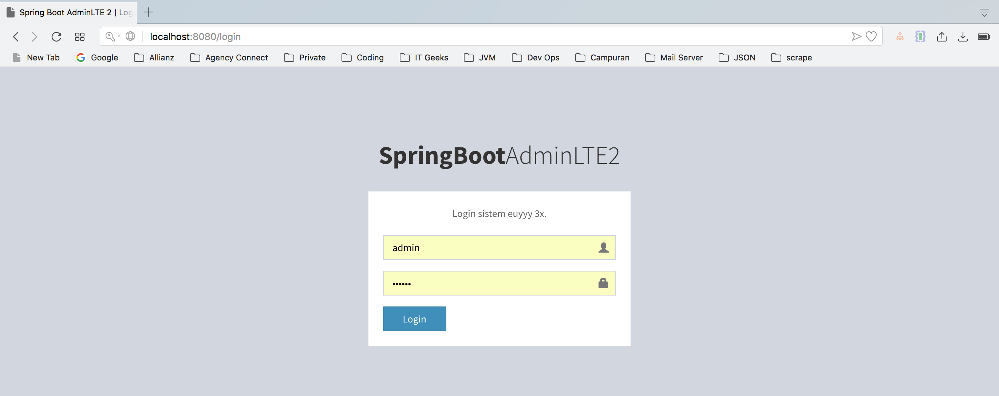
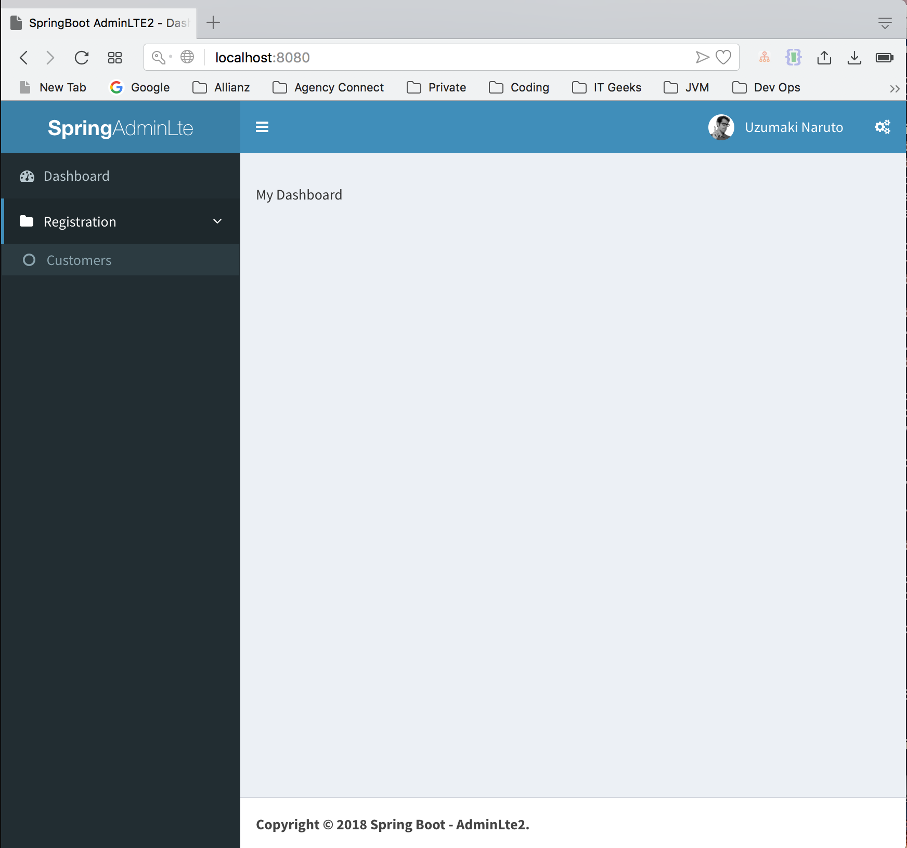
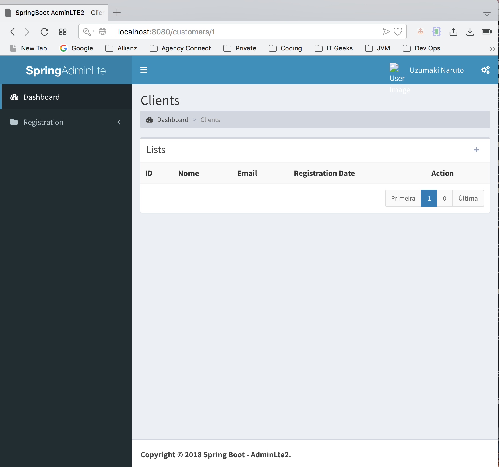

# SpringBoot with AdminLTE 2
---

Application with SpringBoot and the AdminLTE 2 template to facilitate development.

characteristics
---

* Spring Boot;
* Spring Security for basic login with permissions;
* Thymeleaf para view;
* Mysql Bank or others;
* Basic customer crud;

TODO
---

* Search in the listing;
* Model of Dialog;
* Template for sending e-mail with template;

It is free to make changes and implementations and make the code more evolved.

| #   | Username | Password |
| --- |:--------:| --------:|
| 1   | bruno    | 1234     |
| 2   | naruto   | 1234     |

## Screenshot

Login Page

Dashboard Page

List Page

